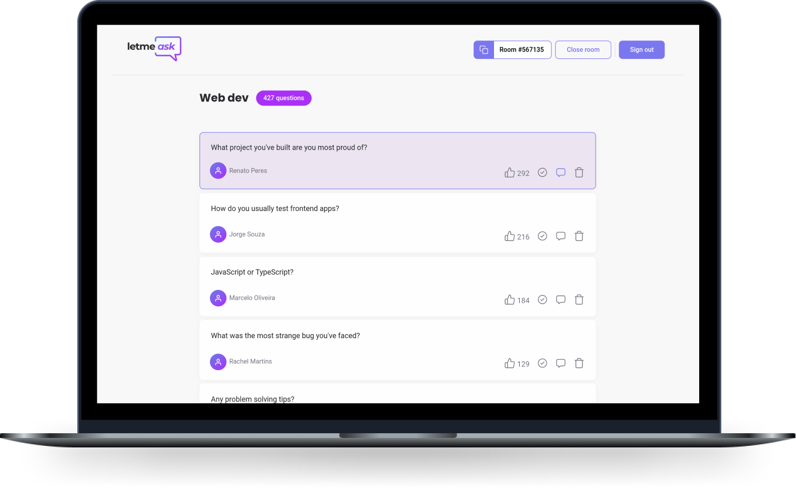

<h1 align="center">
  
</h1>

  
  
  
  

  <a href="#-project">Project</a>&nbsp;&nbsp;&nbsp;|&nbsp;&nbsp;&nbsp;
  <a href="#-technologies">Technologies</a>&nbsp;&nbsp;&nbsp;|&nbsp;&nbsp;&nbsp;
  <a href="#-running-locally">Running locally</a>&nbsp;&nbsp;&nbsp;|&nbsp;&nbsp;&nbsp;
  <a href="#-license">License</a>

 

  

## 💻 Project

Letmeask is a platform for hosting real-time Q&A rooms. It provides an intuitive interface for receiving and answering questions from your audience! Check it out at https://meask.vercel.app.

### 🚀 Features

- Create, share and close Q&A rooms
- Ask, like, highlight and delete questions
- Interact with your guests in real-time
- Sign up with Google
- Install it on your computer or smartphone (PWA supported!)

## ✨ Technologies

This project was developed with the following technologies:

- [TypeScript](https://www.typescriptlang.org)
- [React](https://reactjs.org) + [Next.js](https://nextjs.org)
- [Styled Components](https://styled-components.com)
- [Firebase](https://firebase.google.com)
- [Babel](https://babeljs.io) + [ESLint](https://eslint.org) + [Prettier](https://prettier.io)

> Deployed to [Vercel](https://vercel.com/home)

## ⚙ Running locally

1. Clone this repository
1. Install the dependencies with `yarn`
1. Start the development server with `yarn dev`

Now visit [`localhost:3000`](http://localhost:3000) on your favorite browser.

> This project uses [Firebase](https://firebase.google.com), so make sure to create a Firebase project and fill a local `./env` file with its parameters. All necessary environment variables are available at [`.env.example`](.env.example).

## 📄 License

This project is under MIT license. Check [LICENSE](./LICENSE) for more information.

---

Made with ❤ by [Diego Aquino](https://github.com/diego-aquino).
